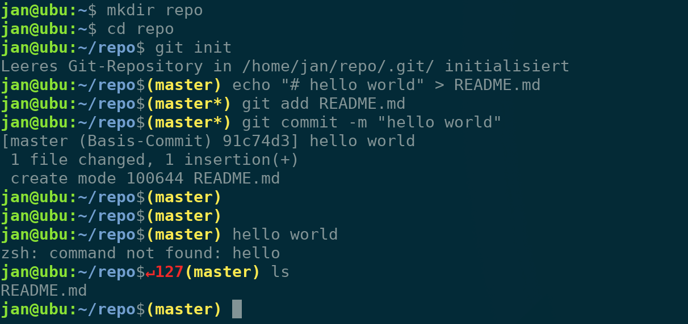

# Ubuntu ZSH theme

Ubuntu zsh theme for ohh-my-zsh



## Install

Copy `ubuntu.zsh-theme` to `~/.oh-my-zsh/custom/themes` and change `ZSH_THEME` in `~/.zshrc` to `ZSH_THEME="ubuntu"`.

### Install script

```sh
curl -so ~/.oh-my-zsh/custom/themes/ubuntu.zsh-theme https://raw.githubusercontent.com/janstuemmel/zsh-ubuntu-theme/master/ubuntu.zsh-theme && sed -i 's/^ZSH_THEME=\".*\"/ZSH_THEME="ubuntu"/' ~/.zshrc
```